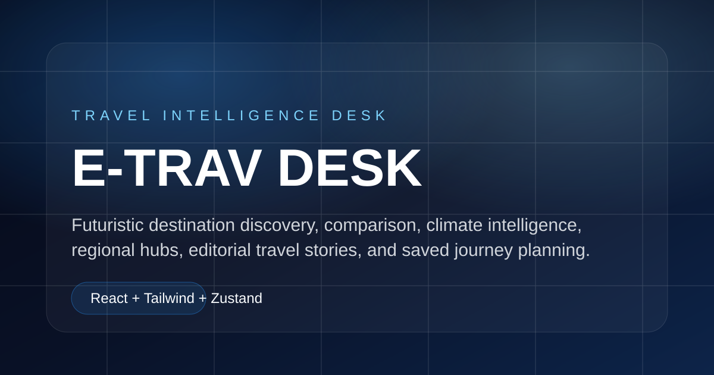

# E-Trav Desk



E-Trav Desk is a React travel intelligence dashboard for exploring destinations, comparing travel conditions, planning routes, and saving trip ideas. It combines public country, weather, air quality, marine, Wikipedia, and World Bank data into a polished frontend experience built for discovery and decision-making.

## Highlights

- Destination search and country discovery powered by public APIs
- Destination detail pages with climate, readiness, economic, seasonal, and risk panels
- Multi-destination comparison tools with charts, matrix views, recommendations, and clustering
- Planner workspace for candidate destinations and travel-window scoring
- Region hubs with climate boards, signal maps, spotlights, and curated collections
- Saved destinations workspace with persisted planning state
- Editorial journal pages for travel themes, region stories, and destination narratives
- Responsive React interface with Tailwind styling, route-level code splitting, and reusable UI primitives

## Tech Stack

- React 18
- Vite
- Tailwind CSS
- React Router
- TanStack Query
- Zustand
- Zod
- Recharts
- Framer Motion
- Lucide React

## Data Sources

- [Open-Meteo Geocoding](https://open-meteo.com/en/docs/geocoding-api)
- [Open-Meteo Forecast](https://open-meteo.com/en/docs)
- [Open-Meteo Air Quality](https://open-meteo.com/en/docs/air-quality-api)
- [Open-Meteo Marine](https://open-meteo.com/en/docs/marine-weather-api)
- [REST Countries](https://restcountries.com/)
- [Wikimedia API Portal](https://api.wikimedia.org/wiki/Main_Page)
- [World Bank Indicators API](https://datahelpdesk.worldbank.org/knowledgebase/articles/889392-about-the-indicators-api-documentation)

## Project Structure

```text
src/
  app/         App providers, routing, and root layout
  components/  Reusable UI, cards, charts, and maps
  features/    Domain features for planner, compare, regions, saved, and journal
  hooks/       Shared React hooks
  lib/         Formatting, scoring, constants, and travel intelligence helpers
  pages/       Route-level screens
  services/    API clients, schemas, mappers, and query keys
  store/       Zustand store and feature slices
  styles/      Tailwind entry and global theme styles
```

## Routes

| Route | Purpose |
| --- | --- |
| `/` | Home and discovery entry |
| `/explore` | Search and filter destination discovery |
| `/destination/:countryCode` | Destination intelligence profile |
| `/compare` | Multi-destination comparison workspace |
| `/planner` | Travel planning and recommendation tools |
| `/regions/:region` | Region intelligence hub |
| `/saved` | Saved destinations and planning workspace |
| `/journal` | Editorial travel stories and collections |
| `/about` | Product story and project overview |

## Getting Started

Install dependencies:

```bash
npm install
```

Start the development server:

```bash
npm run dev
```

Build for production:

```bash
npm run build
```

Preview the production build:

```bash
npm run preview
```

## Deployment

This project is ready for Vercel deployment.

1. Push the repository to GitHub.
2. Import the repo in Vercel.
3. Use the default Vite settings:
   - Build command: `npm run build`
   - Output directory: `dist`
4. Deploy.

The included `vercel.json` file rewrites all routes to `index.html`, which keeps React Router pages working on refresh and direct URL visits.

## Quality Checks

```bash
npm run build
```

The production build validates that the React app, routing, styles, and bundled modules compile successfully.

## Notes

- The app is frontend-only and does not require a custom backend.
- API responses are validated and normalized before being used by feature screens.
- Saved and comparison state is persisted with Zustand middleware.
- The codebase is organized around feature folders so each product area can evolve independently.
